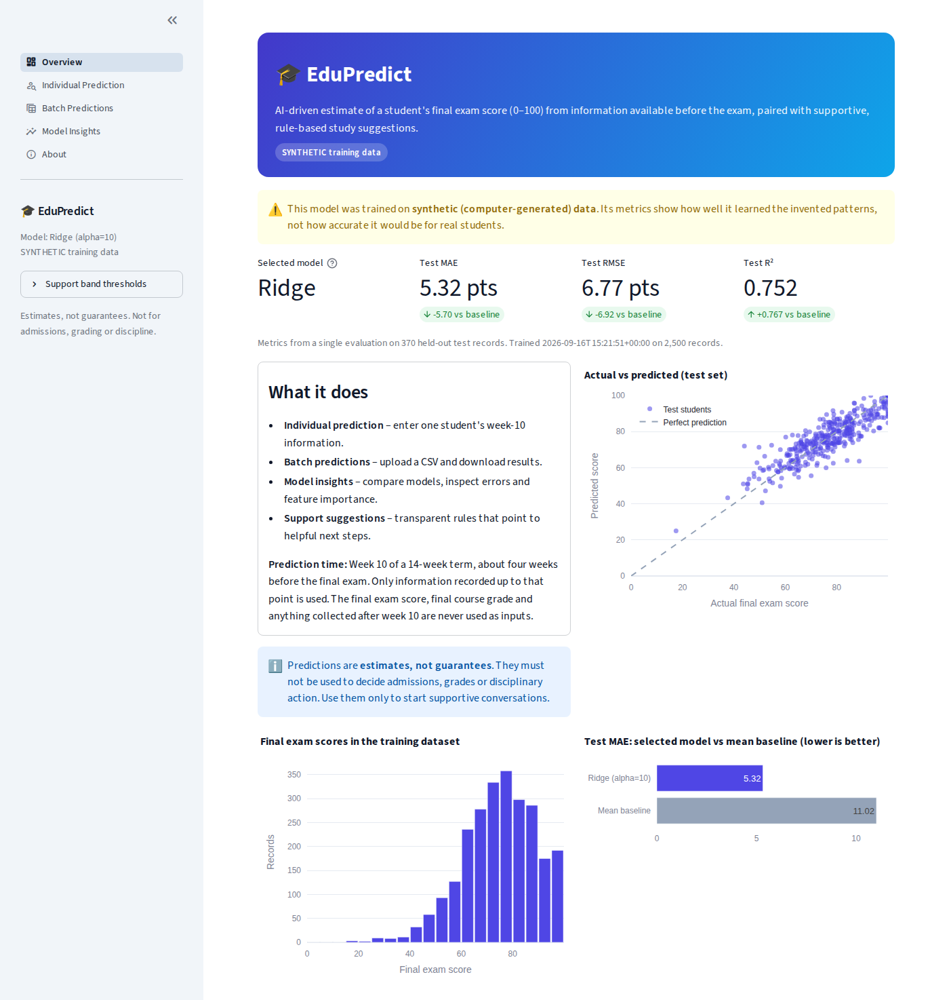
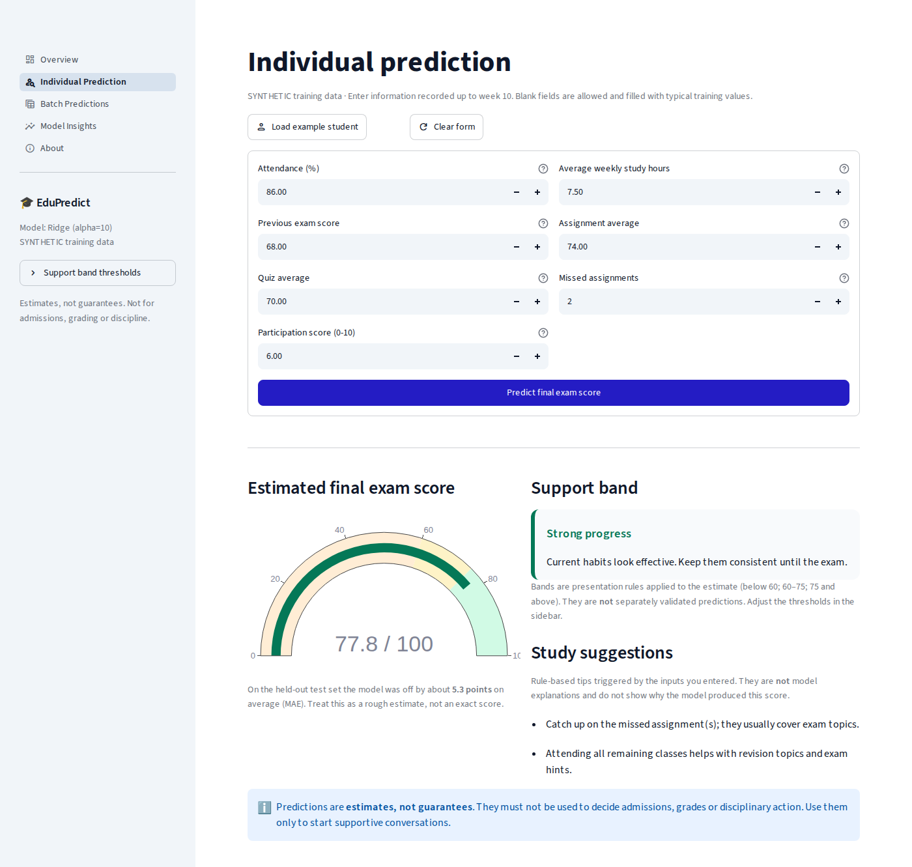
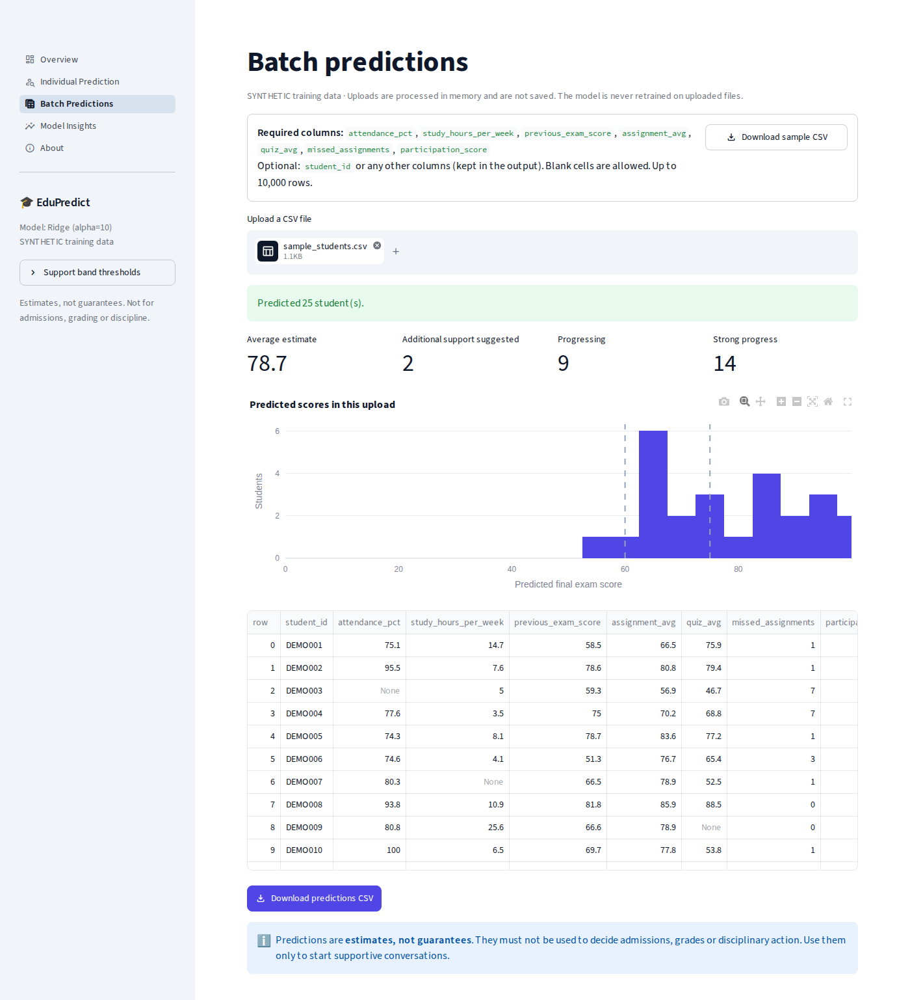
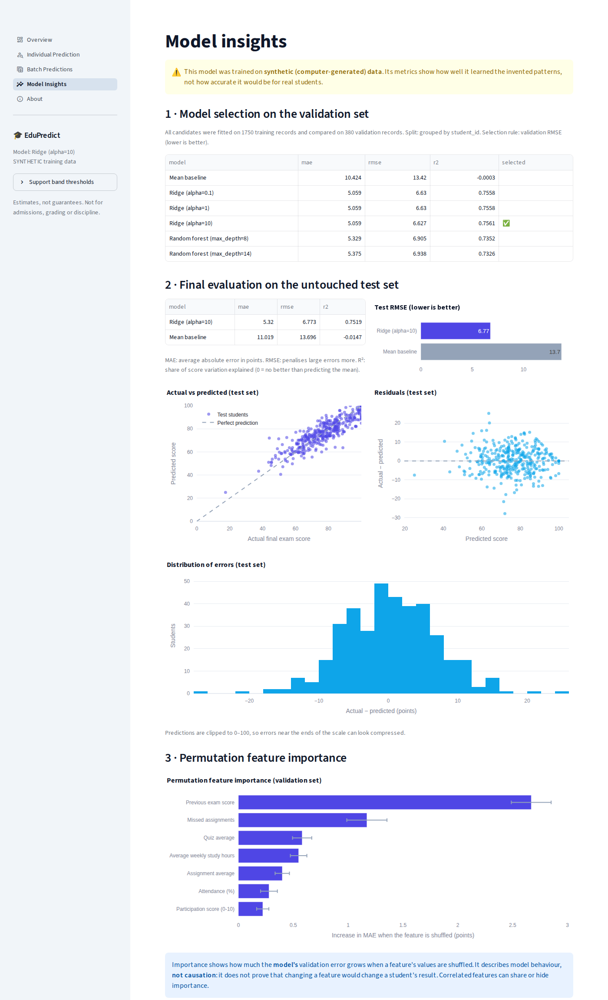

# 🎓 EduPredict — AI-Driven Student Performance Prediction System

EduPredict is a Streamlit web app that **estimates a student's final exam score (0–100)** from information
available *before* the exam, and pairs the estimate with **supportive, rule-based study suggestions**.

**Live demo:** [Open EduPredict](https://edupredict-fu9etexjkddctd8zpzapaw.streamlit.app/)

> ⚠️ **The bundled model is trained on synthetic (computer-generated) data.** Its metrics show how well the
> model learned invented patterns. They do **not** show real-world accuracy.
>
> Predictions are **estimates, not guarantees**. They must **not** be used for admissions, grading or
> disciplinary decisions.



---

## Contents
- [Features](#features)
- [Architecture](#architecture)
- [Machine-learning workflow](#machine-learning-workflow)
- [Installation and usage](#installation-and-usage)
- [Dataset schema](#dataset-schema)
- [Evaluation results](#evaluation-results)
- [Screenshots](#screenshots)
- [Deployment](#deployment)
- [Privacy, limitations and responsible use](#privacy-limitations-and-responsible-use)
- [Interview summary](#interview-summary)
- [Future improvements](#future-improvements)
- [License](#license)

## Features

| Page | What it does |
|------|--------------|
| **Overview** | Purpose, synthetic/real data badge, real test metrics and sample charts |
| **Individual Prediction** | Validated form, *Load example student* button, score gauge, configurable support band, rule-based suggestions |
| **Batch Predictions** | CSV upload (processed in memory), downloadable sample CSV, clear missing-column and invalid-value reports, CSV export |
| **Model Insights** | Baseline vs. trained models, actual-vs-predicted and residual charts, permutation importance, limitations and bias |
| **About** | Workflow, schema, algorithms, limitations, future improvements |

## Architecture

```
EduPredict/
├── app.py                     # Streamlit entry point: page config, sidebar, navigation
├── views/                     # One file per page
│   ├── overview.py
│   ├── individual_prediction.py
│   ├── batch_predictions.py
│   ├── model_insights.py
│   └── about.py
├── src/
│   ├── config.py              # Feature schema, ranges, paths, band thresholds, prediction time
│   ├── data.py                # Synthetic data generator, CSV loading, schema table
│   ├── validation.py          # Required columns, numeric types, value ranges
│   ├── train.py               # Split → fit candidates → select on validation → test once → save
│   ├── predict.py             # Load trusted artifacts, single + batch prediction
│   ├── recommendations.py     # Support bands + rule-based study suggestions
│   ├── charts.py              # Plotly figures
│   └── ui.py                  # Shared Streamlit helpers (cached model loading, notices)
├── scripts/generate_demo_data.py
├── data/sample_students.csv   # Small, synthetic, input-only sample for batch demo
├── models/                    # edupredict_model.joblib + metadata.json (synthetic demo)
├── tests/                     # pytest suite (validation, model, app smoke tests)
├── docs/screenshots/
├── .streamlit/config.toml
├── .github/workflows/tests.yml
├── requirements.txt / requirements-dev.txt
├── Dockerfile / .dockerignore / .gitignore
└── LICENSE
```

**Data flow:** `generate_demo_data.py` → CSV → `train.py` (uses `validation.py`) → `models/` artifacts →
`app.py` loads them **once** with `st.cache_resource` → `predict.py` + `recommendations.py` → charts.

## Machine-learning workflow

**Prediction time.** Week 10 of a 14-week term, about four weeks before the final exam. Only information
recorded up to that point is used. The final exam score, final grade and anything collected after week 10
are never inputs.

1. **Validation** – required columns, numeric values, allowed ranges, whole numbers where needed. Blank
   feature cells are allowed (they are imputed). Training stops if any value is invalid.
2. **Split** – 70 % train / 15 % validation / 15 % test with a fixed seed (42). When `student_id` is present
   the split is **grouped by student** (`GroupShuffleSplit`), so repeat records of one student never appear in
   two splits. The synthetic data has 2,000 students and 2,500 records (25 % of students appear twice).
3. **Preprocessing inside pipelines** – `SimpleImputer(median, add_indicator=True)` (+ `StandardScaler` for
   Ridge). Because preprocessing is part of each scikit-learn `Pipeline`, it is fitted **on training data only**.
4. **Candidates** – mean baseline (`DummyRegressor`), Ridge (α = 0.1, 1, 10), Random forest (max depth 8, 14).
5. **Model selection** – lowest **validation RMSE** among trained models.
6. **Final evaluation** – the selected model and the baseline are scored **once** on the untouched test set
   (MAE, RMSE, R²). Predictions are clipped to 0–100.
7. **Permutation importance** – computed on the **validation** set (increase in MAE when a feature is shuffled).
8. **Artifacts** – `models/edupredict_model.joblib` (full pipeline) and `models/metadata.json` (feature schema,
   training date, dataset type, split sizes, all metrics, importance, test predictions, library versions).

## Installation and usage

Requires **Python 3.11 or 3.12**.

```bash
# 1. Create and activate a virtual environment
python3 -m venv .venv
source .venv/bin/activate            # Windows: .venv\Scripts\activate

# 2. Install dependencies (includes pytest)
pip install -r requirements-dev.txt

# 3. Generate the synthetic dataset (2,500 records, seed 42)
python scripts/generate_demo_data.py

# 4. Train, select and evaluate the model
python -m src.train --data data/students_synthetic.csv --dataset-type synthetic

# 5. Run the tests
pytest -q

# 6. Launch the app → http://localhost:8501
streamlit run app.py
```

### Training on a real dataset
Prepare a CSV with the [schema](#dataset-schema) (including `final_exam_score`, ideally `student_id`), then:

```bash
python -m src.train --data path/to/your_students.csv --dataset-type real --output-dir models/private
```

`models/private/` is git-ignored. To use it in the app, copy the two artifact files into `models/` **only on a
private machine or deployment you control**, and never commit real student data or models trained on it.

The app **never retrains** on uploaded prediction files and **never loads user-uploaded model files**
(unpickling untrusted files can run arbitrary code).

## Dataset schema

| Column | Type | Range | Blank allowed | Description |
|--------|------|-------|---------------|-------------|
| `attendance_pct` | number | 0–100 | yes | Share of classes attended, weeks 1–10 |
| `study_hours_per_week` | number | 0–60 | yes | Self-reported average weekly study hours |
| `previous_exam_score` | number | 0–100 | yes | Most recent prior exam (e.g. midterm) |
| `assignment_avg` | number | 0–100 | yes | Mean assignment score graded by week 10 |
| `quiz_avg` | number | 0–100 | yes | Mean quiz score graded by week 10 |
| `missed_assignments` | integer | 0–30 | yes | Assignments not submitted by week 10 |
| `participation_score` | number | 0–10 | yes | Instructor-rated participation |
| `final_exam_score` | number | 0–100 | **no** | **Training target only** – never an input |
| `student_id` | text | – | optional column | Used to group repeat records in the split |

Example input (the app's *Load example student*):

```csv
student_id,attendance_pct,study_hours_per_week,previous_exam_score,assignment_avg,quiz_avg,missed_assignments,participation_score
DEMO-EX,86,7.5,68,74,70,2,6
```

## Evaluation results

Produced by `python -m src.train --data data/students_synthetic.csv --dataset-type synthetic`
(seed 42, 1,750 train / 380 validation / 370 test records). **Synthetic data – not evidence of real-world accuracy.**

**Validation set (used for model selection)**

| Model | MAE | RMSE | R² |
|-------|----:|-----:|---:|
| Mean baseline | 10.424 | 13.420 | -0.0003 |
| Ridge (α=0.1) | 5.059 | 6.630 | 0.7558 |
| Ridge (α=1) | 5.059 | 6.630 | 0.7558 |
| **Ridge (α=10)** ✅ selected | 5.059 | **6.627** | 0.7561 |
| Random forest (max_depth=8) | 5.329 | 6.905 | 0.7352 |
| Random forest (max_depth=14) | 5.375 | 6.938 | 0.7326 |

**Test set (single final evaluation)**

| Model | MAE | RMSE | R² |
|-------|----:|-----:|---:|
| Ridge (α=10) | 5.320 | 6.773 | 0.7519 |
| Mean baseline | 11.019 | 13.696 | -0.0147 |

Ridge beat the random forest here because the synthetic target is mostly a noisy, near-linear combination of
the inputs. On real data the ranking may differ, which is why selection is done on validation results rather
than fixed in advance.

## Screenshots

Captured from the running app (headless Chromium).

| Individual prediction | Batch predictions |
|---|---|
|  |  |



## Deployment

### Model availability strategy
The synthetic demo artifacts are tiny (a few KB), contain no personal data and are fully reproducible from
seed 42, so `models/edupredict_model.joblib` and `models/metadata.json` are **committed**. Library versions are
pinned in `requirements.txt` so the artifact loads with the versions it was trained with.
- **Streamlit Community Cloud** uses the committed artifacts (no build step needed).
- **Docker** regenerates the data and retrains during `docker build`, so the image is self-contained.
- If the artifacts are missing, the app shows the exact commands to run plus a button to build the synthetic
  demo model explicitly.

If you change library versions, retrain and commit the new artifacts.

### Push to GitHub
1. Create an empty repository on GitHub named `EduPredict` (no README, .gitignore or license — the project has them).
2. In the project folder:
   ```bash
   git init -b main
   git add .
   git status                     # check: no data/students_synthetic.csv, no .venv
   git commit -m "Initial commit: EduPredict"
   git remote add origin https://github.com/<your-username>/EduPredict.git
   git push -u origin main
   ```
3. Open the **Actions** tab to see the `tests` workflow run.

### Deploy on Streamlit Community Cloud
Live application: [edupredict-fu9etexjkddctd8zpzapaw.streamlit.app](https://edupredict-fu9etexjkddctd8zpzapaw.streamlit.app/)

1. Sign in at [share.streamlit.io](https://share.streamlit.io) with GitHub.
2. Click **Create app** → **Yup, I have an app**.
3. Fill in **Repository** `<your-username>/EduPredict`, **Branch** `main`, **Main file path** `app.py`,
   and optionally a custom **App URL**.
4. Open **Advanced settings** and choose **Python 3.12** (or 3.11). No secrets are needed.
5. Click **Deploy** and wait for dependencies to install. Community Cloud reads `requirements.txt` from the repo root.

Reference: [Deploy your app](https://docs.streamlit.io/deploy/streamlit-community-cloud/deploy-your-app/deploy) ·
[App dependencies](https://docs.streamlit.io/deploy/streamlit-community-cloud/deploy-your-app/app-dependencies)

### Docker
```bash
docker build -t edupredict .
docker run --rm -p 8501:8501 edupredict
# open http://localhost:8501
```
The container listens on port **8501**, runs as a non-root user, and has a health check on `/_stcore/health`.

### GitHub Actions
`.github/workflows/tests.yml` runs on pushes to `main` and on pull requests (Python 3.11 and 3.12): installs
dependencies, generates data, runs the training CLI and executes `pytest`.

## Privacy, limitations and responsible use

- **Privacy:** uploaded CSVs are read in memory and not written to disk by the app. Don't upload data you are not
  authorised to process. Never commit real student data or models trained on it.
- **Synthetic data:** relationships are invented; metrics don't transfer to real classrooms.
- **Missing context:** health, work or caring duties, disability accommodations, language background and
  course difficulty are not captured.
- **Measurement bias:** participation is subjective; study hours are self-reported.
- **Historical bias:** real training data can encode past inequalities (e.g. attendance affected by transport).
- **No fairness audit:** subgroup performance is unknown.
- **Support bands** are presentation rules on the estimate, not separately validated predictions.
- **Study suggestions** are hand-written rules on the inputs, not model explanations or proven interventions.
- **Feature importance** describes model behaviour, not causation.

## Interview summary

> *EduPredict predicts a student's final exam score at week 10 of the term, using only information available
> by then: attendance, study hours, previous exam, assignment and quiz averages, missed assignments and
> participation.*
>
> **Why these models?** I start with a mean baseline, so every model has to prove it adds value. Ridge
> regression is a strong, interpretable linear model that handles correlated features like quiz and assignment
> averages. A random forest checks whether non-linear effects improve results. I don't pick the winner in
> advance: the model with the best validation RMSE is selected, which was Ridge on this synthetic data.
>
> **How did I prevent leakage?** I defined the prediction time, so nothing from after week 10 is an input.
> Imputation and scaling are inside scikit-learn pipelines, so they're fitted on training data only. I split by
> student ID, so repeat students never appear in both training and evaluation. Model choice uses the
> validation set, and the test set is used exactly once.
>
> **What's needed before real-world use?** Real, consented and de-identified data, evaluated on a later term
> or another institution. Also a fairness audit across student groups, calibrated uncertainty ranges, review by
> educators and a data-protection check. The model should only support conversations, never make decisions
> about students.

## Future improvements
- Prediction intervals (quantile regression or conformal prediction)
- Subgroup error and fairness analysis on real, consented data
- Time-based validation (train on earlier terms, test on later ones)
- Per-student explanations (e.g. SHAP), kept separate from rule-based suggestions
- Data-drift monitoring and a model card
- Educator feedback to evaluate whether suggestions actually help

## License
Released under the [MIT License](LICENSE).
